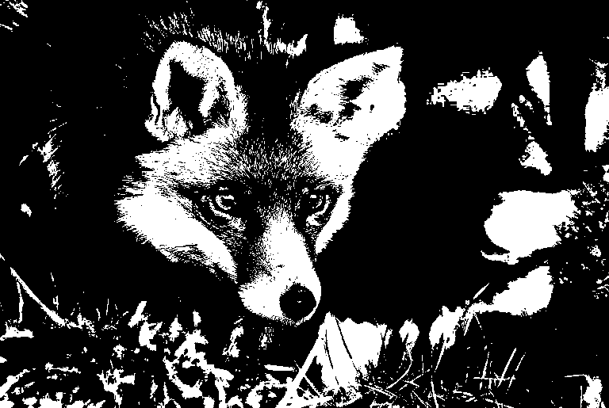

# Преобразование BMP формата в монохром
>В папке [images](./images) находятся изображения формата bmp с разным
количеством бит на пиксель. Также для каждой из них показан результат 
работы программы.

### Требования к программе

1. Работа с программой через командную строку.
2. Формат аргументов командной строки должен соответствовать формату:  
**--input=fileIn.bmp --output=fileOut.bmp**  
3. Программа не должна зависеть от порядка аргументов.
4. В случае неправильного формата аргументов, их отсутствия, невозможности
открыть входной файл или если файл не соответствует формату BMP, завершить
программу с кодом **1**.

### Пример работы программы

### Теоритические основы

BMP (Bitmap Picture) - формат хранения растровых изображений. На каждый пиксель файла
данного формата может приходиться разное количество бит (глубина цвет). Microsoft предлагает
битности 1, 2, 4, 8, 16, 24, 32, 48 и 64. `Битности 48 и 64 не пользуются популярностью, поэтому в данной 
программе файлы данного формата не поддерживаются. Битность размерностью 1 тоже не учитывается, так
как она уже является монохромной.`

**Общая струткура формата**

1. Заголовок из структуры BITMAPFILEHEADER и блока BITMAPINFO. В данной программе 
эта структура выражена в [BMP.h](./BMP.h).
2. Цветовой профиль (опциональный).
3. Пиксельные данные.

С более подробным описанием вы можете ознакомиться на [википедии](https://ru.wikipedia.org/wiki/BMP).
